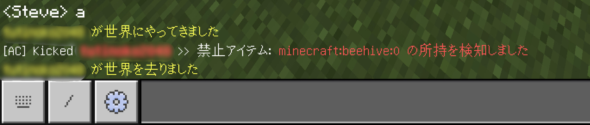
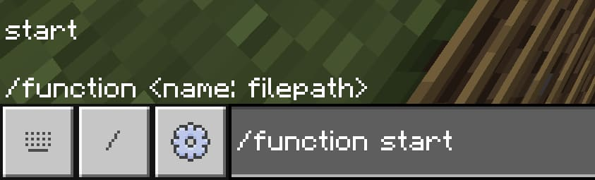
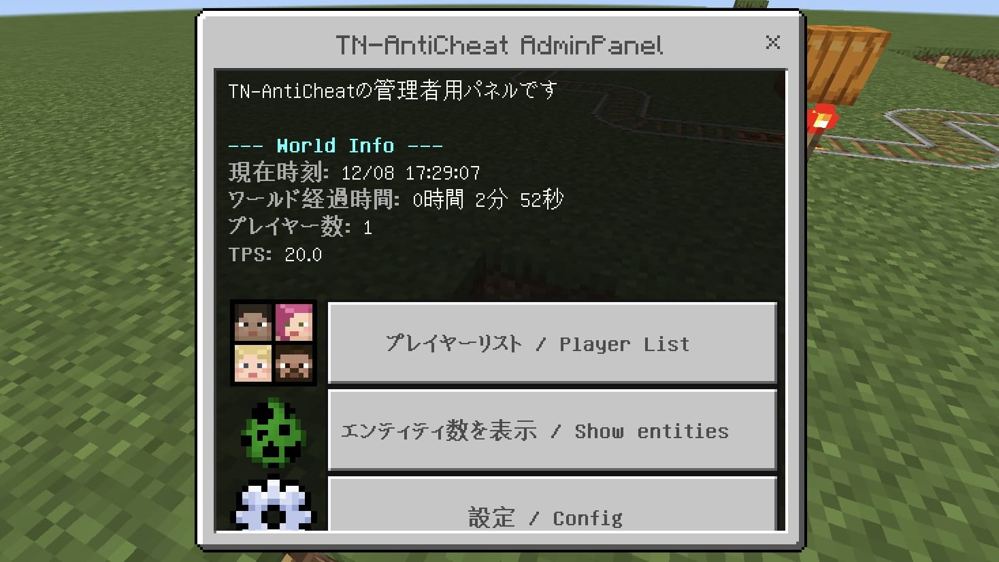
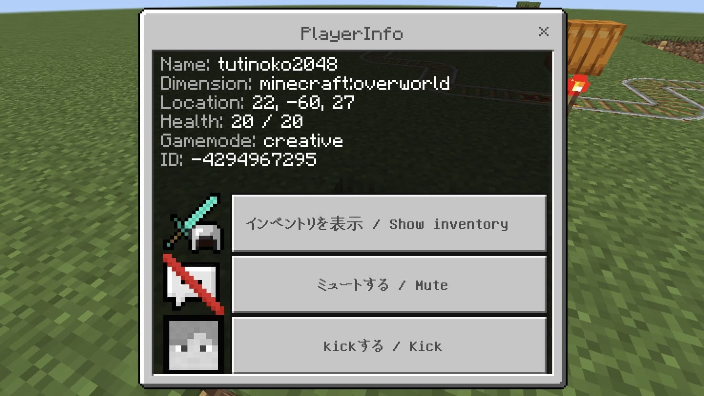
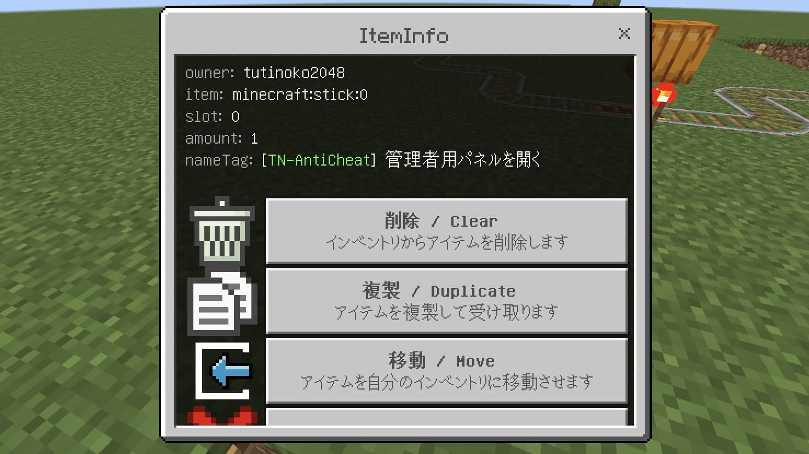
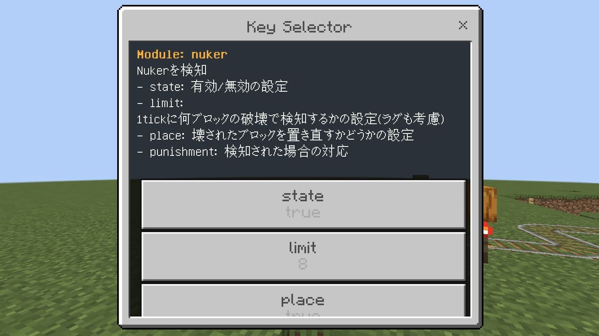

# TN-AntiCheat
  
   

MinecraftBE用のチート対策アドオンです。  
  
[ダウンロードはこちらから](https://github.com/tutinoko2048/TNAntiCheat/releases)
  
  
  
  
  
  
  
> **Note**: 質問やアップデート情報はこちらから！！  
https://discord.gg/XGR8FcCeFc  

## 使い方
まずはアドオンをインポートし、ワールドに適用してください。  
__このときワールドの設定から `"ベータ API"` と `"Education Edition"` をオンにしておいてください。__  
初回はワールドを開いた後に `/function start` コマンドを打ってください。これによりアドオンが有効化され、権限を取得できます。  
(player.jsonが競合している場合は`/scriptevent ac:start`でも可)  
  

### よくある質問
Q. アドオン入れたのに何も反応しません  
A. 上の [使い方](#使い方) の手順に従ってください。ワールドの試験的設定をオンにし忘れてることが多いです。  
また、アドオン内部のファイルを編集した場合は構文エラーが出ている可能性もあります。
[BDSの方はこちらも見てください](#BDS)

Q. 運営だけ検知から除外したいです  
A. opコマンドを使いましょう。`!op [プレイヤー名]`で指定したプレイヤーにadminの権限を与えることができます。

Q. 使えるコマンド一覧は？  
A. ワールド内で`!help`してみてください。各コマンドの詳細は`!help <コマンド名>`で見られます。

## Modules

<bold>モジュール一覧を表示</bold>

- AutoClicker  
高すぎるCPSを検知

- Crasher  
クラッシャー(座標をいじるタイプ)を検知

- Creative  
Builder権限がないプレイヤーのクリエイティブを検知

- EntityCheck/A  
禁止エンティティのスポーンを検知

- EntityCheck/B  
禁止アイテムがドロップしたことを検知

- EntityCheck/C  
1tickにスポーンできるエンティティの量を制限

- EntityCheck/D  
チェスト付きトロッコやボートの中身をチェック

- EntityCounter  
エンティティの数が異常に多い時に警告を表示

- ItemCheck/A  
禁止アイテムの所持を検知

- ItemCheck/B  
スポーンエッグの所持を検知

- ItemCheck/C  
不正な個数のアイテムの所持を検知

- ItemCheck/D  
不正なレベルのエンチャントを検知

- ItemCheck/E  
アイテムに付与できないエンチャントを検知

- NameSpoof  
変な名前を検知

- Nuker  
Nukerの使用を検知

- PlaceCheck/A  
禁止アイテム・ブロックの設置を検知

- PlaceCheck/B  
禁止アイテムの入ったチェストの設置を検知

- PlaceCheck/C  
設置時にディスペンサーなどの指定したブロックのNBTを削除

- PlaceCheck/D  
エンティティを出すアイテムの使用時にNBTを削除

- Reach  
長すぎるリーチを検知(エンティティへの攻撃とブロックの設置・破壊)

- Spammer/A  
文字数の多すぎるチャットを制限

- Spammer/B  
重複するチャットを制限

- Spammer/C  
タイピング速度が速すぎるチャットを制限

- Speed/A  
速すぎる移動を検知

## その他の機能
- Command  
コマンド一覧は `!help` でチェックしてみよう！  
scripteventコマンドからアドオンのコマンドを動かすこともできます  
例: `/scriptevent ac:command settings`  

- Ban/Unban  
プレイヤーをbanできます。プレイヤー名やXUIDで指定することもできます。  
banを解除したい場合は`unban`コマンドを使うか、アドオンフォルダ内の`unban_queue.js`に名前を入力してください。

- Permission  
プレイヤーごとの権限を管理できます。(`admin`, `builder`)  
`permission`コマンドで追加や削除ができます。  
例: `!permission add <権限名> <プレイヤー名>`  
  > **Note**  
  builder権限をつけるとCreativeの検知から除外されます

- Admin Panel  
管理者用のForm画面です。

<strong>詳しい使い方はこちら</strong>

`!settings`コマンドや`!settingitem`コマンドで入手できるアイテムを使用することで画面を開くことができます。  
プレイヤーやインベントリの管理ができます  
プレイヤーに向けて棒(settingitem)を使うと
  
  

  
 

- Chat Filter  
設定した単語を非表示にできます。単語はアドオンフォルダ内の`chat_filter.js`で追加できます。

- Config  
ワールド内でConfig(このアドオンの設定)を編集できます  
アドオンフォルダ内の`config.js`ファイルを直接編集することもできます  
  

## BDS
現在BDSにはop関連の機能に~~バグ~~(そういう仕様のようです)があるため個別に対策する必要があります  
Configのothersから `fixBDS` をtrueにしてください

## Acknowledgements
- [Scythe-AntiCheat](https://github.com/MrDiamond64/Scythe-AntiCheat)
- [timer.js](https://github.com/Lapis256/timer.js)
- [gametest-utility-library/toJson](https://github.com/Lapis256/gametest-utility-library)
