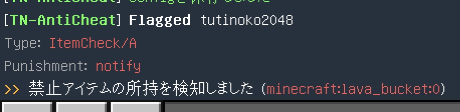
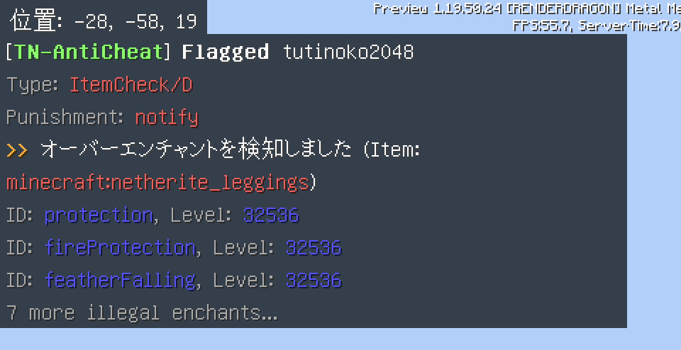
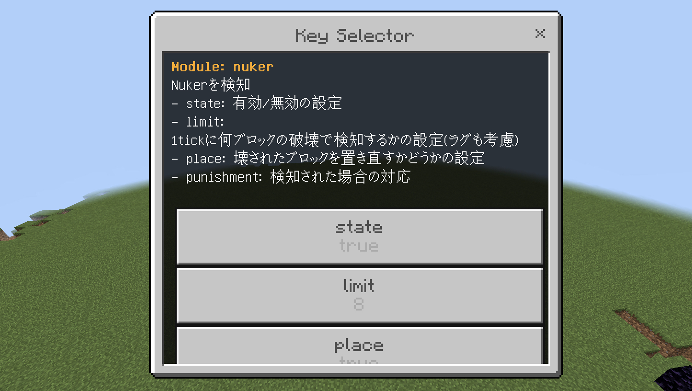

# TN-AntiCheat
  
  
  

MinecraftBE用のチート対策アドオンです。  
  
[ダウンロードはこちらから](https://github.com/tutinoko2048/TNAntiCheat/releases)
  
  
  
  
  
  
  
  
※一部のコードはMrDiamond64様の[Scythe-AntiCheat](https://github.com/MrDiamond64/Scythe-AntiCheat)を参考にしています。
  
> **Note**: 質問やアップデート情報はこちらから！！  
https://discord.gg/XGR8FcCeFc  

## 使い方
まずはアドオンをインポートし、ワールドに適用してください。  
__このときワールドの設定から `"ベータ API"` と `"Edication Edition"` をオンにしておいてください。__  
初回はワールドを開いた後に `/function start` コマンドを打ってください。これによりアドオンが有効化され、権限を取得できます。

## Modules
- AutoClicker(β)  
高すぎるCPSを検知

- Crasher  
クラッシャー(座標をいじるタイプ)を検知

- Creative  
Builder権限がないプレイヤーのクリエイティブを検知

- EntityCheck/A  
禁止エンティティのスポーンを検知

- EntityCheck/B  
禁止アイテムがドロップしたことを検知

- EntityCheck/C  
1tickにスポーンできるエンティティの量を制限

- EntityCheck/D  
チェスト付きトロッコやボートの中身をチェック

- ItemCheck/A  
禁止アイテムの所持を検知

- ItemCheck/B  
スポーンエッグの所持を検知

- ItemCheck/C  
不正な個数のアイテムの所持を検知

- ItemCheck/D  
不正なレベルのエンチャントを検知

- NameSpoof  
変な名前を検知

- Nuker  
Nukerの使用を検知

- PlaceCheck/A  
禁止アイテム・ブロックの設置を検知

- PlaceCheck/B  
禁止アイテムの入ったチェストの設置を検知

- PlaceCheck/C  
設置時にディスペンサーなどの指定したブロックのNBTを削除

- Reach(β)  
長すぎるリーチを検知(エンティティへの攻撃とブロックの設置・破壊)

- Spammer/A  
文字数の多すぎるチャットを制限

- Spammer/B  
重複するチャットを制限

- Spammer/C  
タイピング速度が速すぎるチャットを制限

## その他の機能
- Command  
コマンド一覧は `!help` でチェックしてみよう！

- Ban  
プレイヤーをbanできます。プレイヤー名やXUIDで指定することもできます。  
banを解除したい場合はアドオンフォルダ内の`unban_queue.js`に名前を入力してください。

- Permission  
プレイヤーごとの権限を管理できます。(`admin`, `builder`)  
`permission`コマンドで追加や削除ができます。

- Admin Panel  
管理者用のForm画面です。

- Chat Filter  
設定した単語を非表示にできます。単語はアドオンフォルダ内の`chat_filter.js`で追加できます。

- Config Editor  
ワールド内でConfig(このアドオンの設定)を編集できます  
  

## config
アドオンフォルダ内の`config.js`ファイルで各種機能の設定をすることができます  

