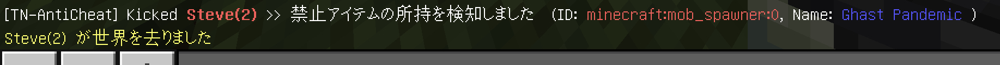
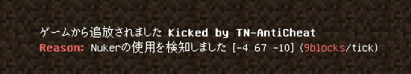
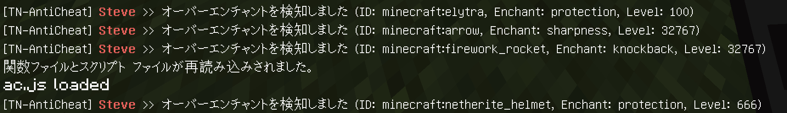
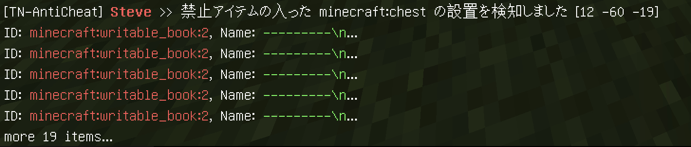
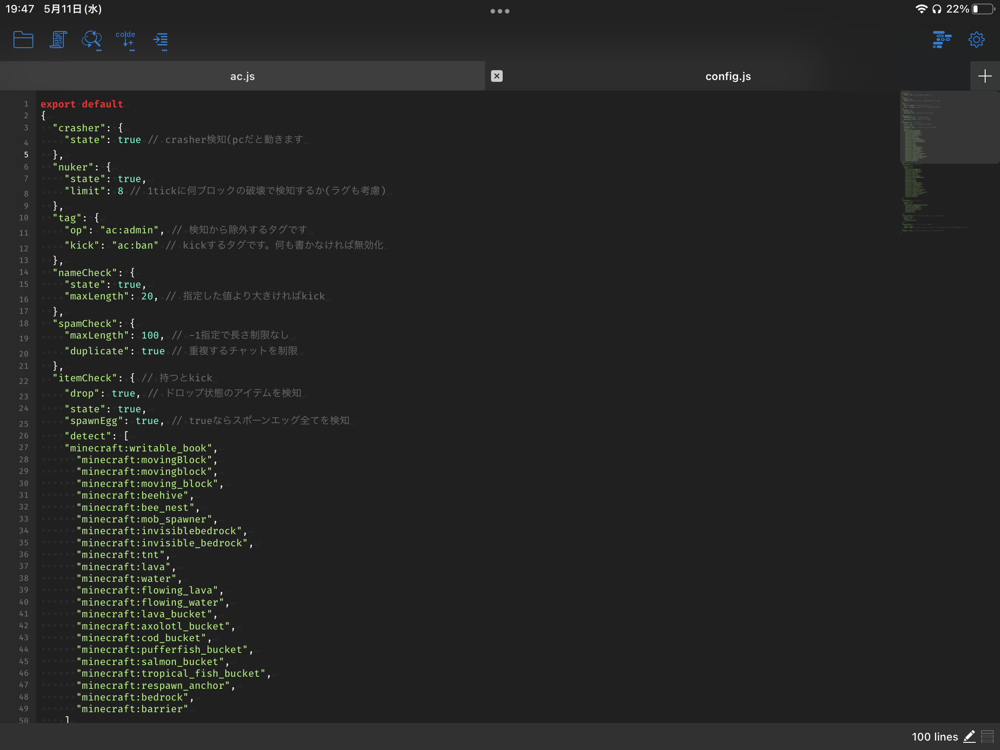

# TNAntiCheat
  
  
  

MinecraftBE用のチート対策アドオンです。  
※ワールドの設定から "ゲームテスト フレームワーク" を必ず有効にしてください  
[ここ](https://github.com/tutinoko2048/TNAntiCheat/releases)から最新のものをダウンロードできます。  
  
  
  
  
  
  
  
  

  
※一部のコードはMrDiamond64様の[Scythe-AntiCheat](https://github.com/MrDiamond64/Scythe-AntiCheat)を参考にしています。
  
> **Note**: 質問やアップデート情報はこちらから！！  
https://discord.gg/XGR8FcCeFc  

## Modules
- AutoClicker(β)  
高すぎるCPSを検知

- Crasher  
クラッシャー(座標をいじるタイプ)を検知

- EntityCheck/A  
禁止エンティティのスポーンを検知

- EntityCheck/B  
禁止アイテムがドロップしたことを検知

- EntityCheck/C  
1tickにスポーンできる矢の量を制限(クロスボウのマルチショット対策)

- ItemCheck/A  
禁止アイテムの所持を検知

- ItemCheck/B  
スポーンエッグの所持を検知

- ItemCheck/C  
1スタックの個数が多すぎるアイテムの所持を検知

- ItemCheck/D  
不正なレベルのエンチャントを検知

- NameSpoof  
変な名前を検知

- Nuker  
Nukerの使用を検知

- PlaceCheck/A  
禁止アイテム・ブロックの設置を検知

- PlaceCheck/B  
禁止アイテムの入ったチェストの設置を検知

- Reach  
長すぎるリーチを検知(エンティティへの攻撃とブロックの設置・破壊)

- Spammer/A  

- Spammer/B  

- Spammer/C  

## その他の機能
- AdminPanel  
管理者用のForm画面です。

- ChatFilter  
設定した単語を非表示にできます

- ConfigEditor  
ワールド内でConfig(このアドオンの設定)を編集できます
  
## config
config.jsファイルで各種機能の設定をすることができます  
タグのついたプレイヤー(デフォルトでは`ac:admin`)は検知から除外されます  

