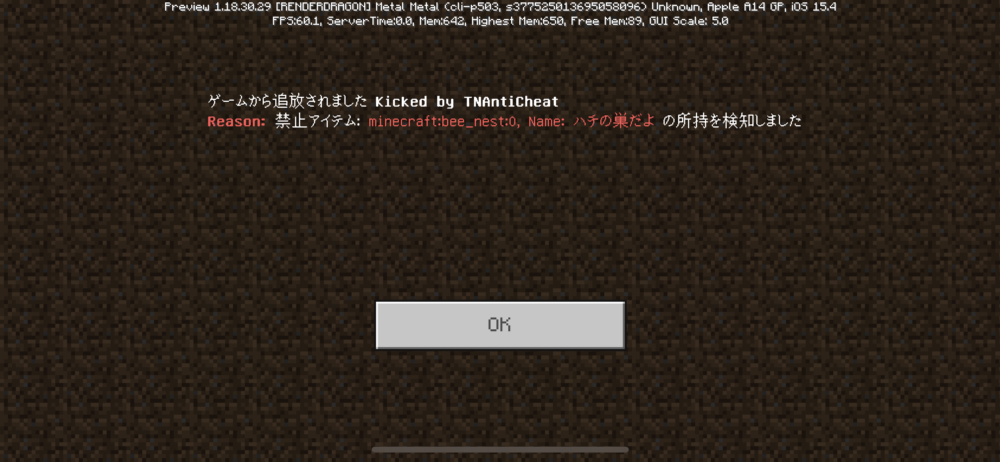

# TNAntiCheat
MinecraftBE用のチート対策アドオンです。  
※ワールドの設定から "ゲームテスト フレームワーク" を必ず有効にしてください  
[ここ](https://github.com/tutinoko2048/TNAntiCheat/releases)から最新のものをダウンロードできます。  
  
https://youtu.be/SZq9z7Lt2bc  
  
  
  
  
※一部のコードはMrDiamond64様の[Scythe-AntiCheat](https://github.com/MrDiamond64/Scythe-AntiCheat)を参考にしています。
  
## 実装済み
- 禁止アイテム,エンティティの所持,設置検知  
アイテム一覧は`scripts/config.js`を参照  

- Crasher(pcだと動きます)
- 長すぎる名前の検知
- tagKick  
"ban"のタグがついた人を自動でkickします
- チェスト設置時に中身をチェック
- 重複した内容のチャットをブロック
- 100文字以上の長いチャットをブロック
- ドロップ状態の禁止アイテムの検知
- オーバーエンチャントの検知

## やりたいやつ
- リーチ?(preview only)

## config
config.jsを編集することで禁止アイテムの追加/削除, 各種機能の有効化/無効化をすることができます  
タグのついたプレイヤー(デフォルトではadmin)は検知から除外されます
